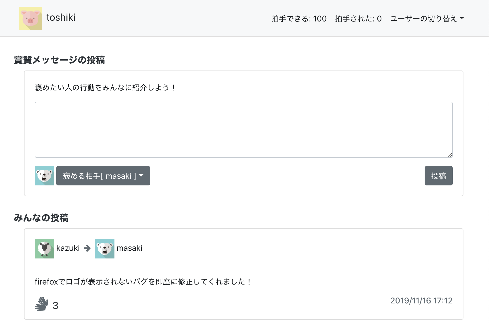

# インターン課題　賞賛アプリ



url: https://nari19.github.io/react-praise-app/

## 起動のための手順

```
// ソースコードをローカルにダウンロード
git clone https://github.com/nari19/react-praise-app.git

// プロジェクトに移動
cd react-praise-app/

// node_moduleインストール
$ npm i

// サーバの起動
$ npm start

=> ブラウザから http://localhost:3000/ にアクセス

============================================================

/// ビルド　=> buildディレクトリの作成 => gh-pagesで公開するので”docs”と名前を変更する
$ npm run build

// docsディレクトリのサーバー
$ serve -s docs
```

## 自己採点(11項目/11項目)

| | | |
|-|-|-|
|○|1|ヘッダーに初期状態で現在ユーザの名前/画像/拍手出来るポイント:100/拍手されたポイント:0が表示される|
|○|2|現在ユーザのアイコンの近辺でユーザを選択できるようになり、選択後はユーザが切り替わる|
|○|3|ヘッダーでユーザを切り替えた後は、そのユーザが持つポイントが正しく表示される(拍手後に確認)|
|○|4|投稿欄のユーザアイコン近辺で褒めたいユーザを選択できる|
|○|5|テキストが5文字以下の場合、投稿ボタンはクリック出来ない|
|○|6|テキストが5文字以上であれば紹介が投稿される|
|○|7|一覧に追加された紹介した人/された人、テキスト、拍手数、投稿日時が正しく表示されている|
|○|8|投稿一覧の内容はリロード後も情報は保持される|
|○|9|投稿された人/投稿した人は拍手が出来ない|
|○|10|拍手後は、拍手した人の拍手できるポイントが-2,紹介した/された人には拍手されたポイントが+1される|
|○|11|拍手数のマウスホバーにより、拍手した人と拍手数が一覧表示される|
